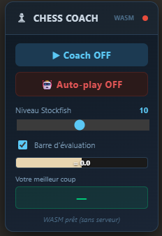
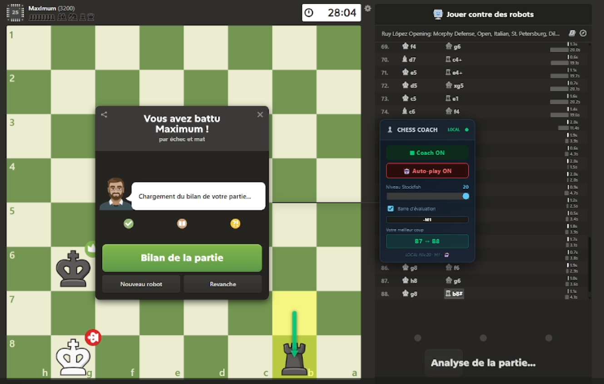
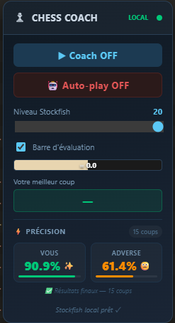

# ♟ Chess Script — Stockfish pour Chess.com

Un script qui analyse vos parties sur **chess.com** en temps réel grâce à Stockfish, affiche les meilleurs coups avec des flèches, et peut jouer automatiquement à votre place (mode auto-play).

   


---

## 📋 Ce dont vous avez besoin

- **Un navigateur** : Brave, Chrome ou Firefox 
- **Tampermonkey** : une extension navigateur 
- **Python 3.7+** : un langage de programmation 
- **Stockfish** : le moteur d'échecs 
- **Ce script** : les fichiers de ce repo 

---

## 🪜 Installation étape par étape

### Étape 1 — Installer Tampermonkey

Tampermonkey est une extension qui permet d'exécuter des scripts dans votre navigateur.

1. Ouvrez votre navigateur
2. Allez sur le store de votre navigateur :
   - **Chrome / Brave** → [chrome.google.com/webstore](https://chrome.google.com/webstore) → recherchez "Tampermonkey"
   - **Firefox** → [addons.mozilla.org](https://addons.mozilla.org) → recherchez "Tampermonkey"
3. Cliquez **"Ajouter"** ou **"Installer"**
4. allez dans vos extensions navigateur et épinglez Tempermonkey
5. Une icône Tampermonkey apparaît en haut à droite de votre navigateur ✅
 
   Il se peut que Tempermonkey ne s'active pas immédiatement, si c'est le cas cliquez sur le petit
   bandeau bleu qui s'affichera en haut de la page "tableau de bord" de Tempermonkey et suivez les
   instructions qui s'afficheront pour l'activer.

---

### Étape 2 — Installer Python

Python est nécessaire pour faire tourner le serveur local qui communique avec Stockfish.

1. Allez sur **[python.org/downloads](https://www.python.org/downloads/)**
2. Cliquez sur le gros bouton **"Download Python"**
3. Lancez l'installateur téléchargé
4. ⚠️ **IMPORTANT** : cochez la case **"Add Python to PATH"** avant de cliquer Install
5. Cliquez **"Install Now"**
6. Une fois terminé, Python est installé ✅

---

### Étape 3 — Installer Stockfish

Stockfish est le moteur d'échecs qui calcule les meilleurs coups.

1. Allez sur **[stockfishchess.org/download](https://stockfishchess.org/download/)**
2. Cliquez sur **Windows**
3. Téléchargez le fichier `.zip`
4. Extrayez le `.zip` — vous obtenez un fichier `.exe`
5. Copiez ce fichier `.exe` dans le dossier `chess-server` (le dossier de ce projet) ✅

---

### Étape 4 — Télécharger ce projet

1. Sur cette page GitHub, cliquez sur le bouton vert **"Code"**
2. Cliquez **"Download ZIP"**
3. Extrayez le ZIP où vous voulez (ex : sur le Bureau)
4. Vous obtenez un dossier `chess-server` avec tous les fichiers ✅

---

### Étape 5 — Installer le script Tampermonkey

1. Cliquez sur l'icône **Tampermonkey** en haut à droite de votre navigateur
2. Cliquez **"Tableau de bord"**
3. Cliquez l'onglet **"Utilitaires"**
4. Dans la section **"Importer depuis un fichier"**, cliquez **"Choisir un fichier"**
5. Sélectionnez le fichier **`chess-coach-v9_5_user.js`** du dossier téléchargé
6. Cliquez **"Installer"** ✅

---

### Étape 6 — Lancer le serveur local

Le serveur local fait le lien entre votre navigateur et Stockfish.

1. Ouvrez le dossier `chess-server`
2. Double-cliquez sur **`lancer.sh`**

   > Si ça ne marche pas, ouvrez PowerShell dans le dossier (cliquez sur la barre d'adresse de l'Explorateur Windows, tapez `powershell`, appuyez sur Entrée) et tapez :
   > ```
   > python server.py
   > ```

3. Une fenêtre noire s'ouvre avec le message `♟ Serveur lancé → http://localhost:8765` ✅
4. **Laissez cette fenêtre ouverte** pendant toute votre session de jeu

---

## 🎮 Utilisation

1. Lancez le serveur (Étape 6)
2. Allez sur **[chess.com](https://www.chess.com)** et commencez une partie contre un bot
3. Le panneau **Chess Coach** apparaît en bas à droite de l'écran
4. Cliquez **"▶ Coach ON"** pour activer l'analyse
5. Une flèche verte indique le meilleur coup à jouer
6. (Optionnel) Cliquez **"🤖 Auto-play ON"** pour que le script joue automatiquement

---

## ⚙️ Options du panneau

**Coach ON/OFF** — Active ou désactive l'analyse en temps réel.

**Auto-play ON/OFF** — Le script joue les coups automatiquement à votre place.

**Niveau Stockfish** — De 1 (analyse rapide et superficielle) à 20 (niveau grand maître, calcul long).

**Barre d'évaluation** — Affiche qui est en avantage dans la partie. Plus la barre est blanche, mieux c'est pour les blancs. Plus elle est noire, mieux c'est pour les noirs.
           
            
            serveur allumé :                  serveur éteint :


         

---

## ❓ Problèmes fréquents

**Le panneau Chess Coach n'apparaît pas**

Vérifiez que Tampermonkey est bien activé (cliquez sur l'icône en haut à droite du navigateur et vérifiez que le script est bien "Activé"). Rechargez ensuite la page chess.com.

**Le point reste rouge (serveur déconnecté)**

Le serveur Python n'est pas lancé. Retournez à l'Étape 6. Le point devient vert quand le serveur tourne correctement.

**La promotion de pion ne se fait pas automatiquement**

Assurez-vous d'utiliser la version **v9.5** du script (le fichier `chess-coach-v9_5_user.js`).

**Stockfish introuvable au démarrage**

Vérifiez que le fichier `.exe` de Stockfish est bien copié dans le dossier `chess-server`. Le nom du fichier doit commencer par `stockfish`.
   

---

## ⚠️ Avertissement

Ce script est conçu pour **s'entraîner contre des bots** sur chess.com. L'utiliser en partie classée contre de vrais joueurs est contraire aux conditions d'utilisation de chess.com.
l'utilisation de ce script contre des joueurs peut entreîner le banissement définitif de votre comte chess.com

---

## 📁 Contenu du projet

- `server.py` — Serveur local Python
- `chess.html` — Interface web optionnelle
- `lancer.sh` — Script de démarrage rapide
- `chess-coach-v9_5_user.js` — Script Tampermonkey à installer
- `README.md` — Ce fichier d'instructions
- `stockfish.exe` — À télécharger séparément sur stockfishchess.org (trop lourd pour GitHub)

---

## Niveau du script

Lorsque le serveur est connecté, ce script atteint un niveau d'environ 3600 elo et une profondeur maximum de 40, soit 20 coups complets et 40 demi-coups. 
La profondeur de stockfish dépendra principalement de la puissance de votre processeur. 
Stockfish a une précision globale de 99. 
Si le serveur n'est pas connecté, ce sera stockfish WASM qui tournera en local sur votre PC qui calculera les coups. 
Stockfish WASM a un niveau elo d'environ 2200 elo et une profondeur maximum de 17 demi-coups. Il est bien plus lent que stockfish 
natal pour calculer les coups. 
SI vous augmentez le niveau de stockfish au dessus de 10, le temps imparti pour chaque coups qu'utilise le script et qui est de 12 secondes 
augmentera. 

Le niveau Stockfish influence directement le temps de calcul entre chaque coup. Voici quelques repères :

Niveau 1 à 5 — calcul quasi instantané, idéal si vous avez peut de temps (blitz) mais moins bonne qualité de coup

Niveau 6 à 10 — quelques secondes de calcul, bon compromis entre vitesse et qualité

Niveau 11 à 15 — calcul plus long (5 à 10 secondes), recommandé des temps plus long

Niveau 16 à 19 — calcul lent, réservé aux parties avec beaucoup de temps ou sans limite de temps

Niveau 20 — profondeur maximale (40 demi-coups), peut prendre jusqu'à 30 secondes selon votre processeur, à utiliser uniquement contre les bots les plus forts sans limite de temps

En mode auto-play, le script attend automatiquement la fin du calcul avant de jouer. Plus votre processeur est puissant, plus les niveaux élevés seront rapides.




---

## Calcul de précision 

Ce script calcule également la précision en temps réel de votre adversaire et vous. 



---

## Mode humain 

Le mode humain simule un joueur humain fort qui fait de petites erreurs naturelles, au lieu de jouer parfaitement à chaque coup.
Comment ça fonctionne :
Quand le mode humain est activé avec l'auto-play, Stockfish analyse les 3 meilleurs coups disponibles à chaque position au lieu du seul meilleur. Ensuite, à chaque coup, un tirage aléatoire détermine lequel jouer :

70% du temps → le meilleur coup est joué normalement
30% du temps → le 2e ou 3e meilleur coup est joué à la place

Le 2e et 3e meilleur coup sont toujours des coups raisonnables — pas des blunders catastrophiques, juste des petites imprécisions qui font perdre quelques centipawns, comme un humain fort le ferait naturellement.
Le délai de jeu est aussi rendu plus réaliste : entre 1.5 et 6 secondes par coup, avec 20% de chance de "réfléchir longtemps" (4 à 9 secondes), simulant les moments d'hésitation humaine.
Impact sur la précision : avec le mode humain actif, votre précision affichée sera autour de 85-92% au lieu de 100%, ce qui est cohérent avec un niveau Grand Maître humain.
Note : le mode humain nécessite le serveur local Stockfish pour fonctionner (point vert dans le panneau). Il n'est pas compatible avec le moteur WASM de secours.


🔄 Rejouer Automatiquement
La case à cocher "Rejouer automatiquement" dans le panneau permet d'enchaîner les parties sans intervention manuelle.
Comment ça fonctionne :
Une fois cochée, le script surveille en permanence la fin de partie. Dès qu'un bouton "Rejouer", "Revanche" ou "Nouvelle partie" apparaît à l'écran, il attend 3 secondes puis clique automatiquement dessus pour lancer une nouvelle partie.
Le délai de 3 secondes est intentionnel — il laisse le temps de décocher l'option si vous souhaitez arrêter avant que la prochaine partie commence.
Important : cette option fonctionne indépendamment du coach et de l'auto-play. Elle détecte le bouton même si le coach est désactivé.


